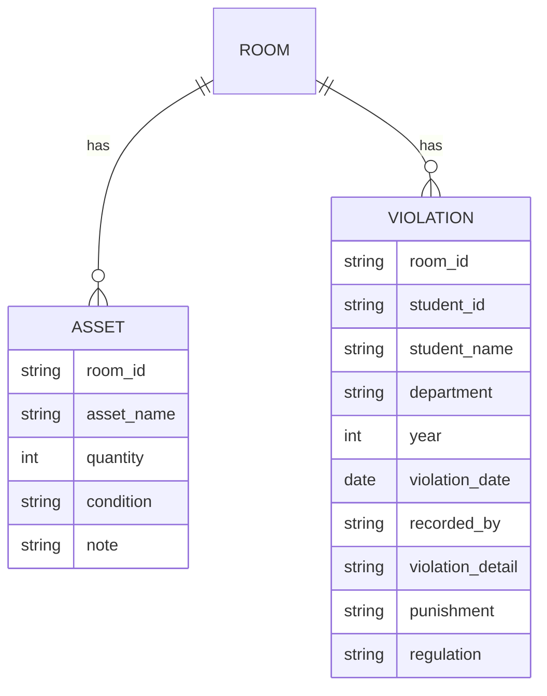
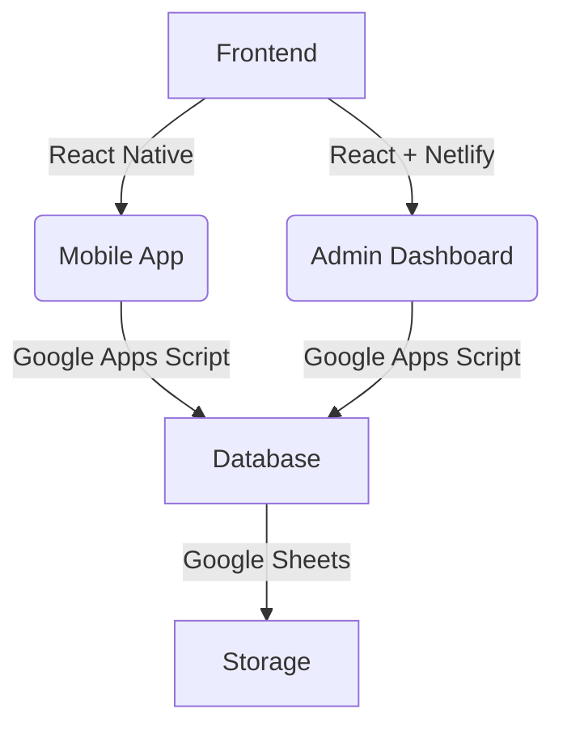

# TÀI LIỆU KỸ THUẬT: ỨNG DỤNG KIỂM KÊ KÝ TÚC XÁ

## 1. Đặt vấn đề
### Hạn chế của phương pháp ghi chép giấy truyền thống
- **Tốn thời gian**: Nhân viên phải viết tay thông tin sau đó nhập lại vào máy, gây mất thời gian và dễ xảy ra sai sót.
- **Khả năng sai sót cao**: Do quá trình nhập liệu thủ công, dễ bị nhầm lẫn số liệu hoặc mất dữ liệu.
- **Khó quản lý và tổng hợp**: Dữ liệu phân tán, khó kiểm tra tổng quan tình trạng phòng.
- **Không có cập nhật theo thời gian thực**: Cần nhập xong toàn bộ trước khi có thể tổng hợp dữ liệu.

**➡ Giải pháp**: Xây dựng một ứng dụng nhập liệu di động kết nối trực tiếp với Google Sheets, giúp kiểm kê tài sản và vi phạm trong ký túc xá nhanh chóng, chính xác và dễ quản lý.

---

## 2. Tính năng của ứng dụng
### 🔹 Kiểm kê tài sản
- Nhân viên kiểm kê chọn phòng từ danh sách.
- Nhập thông tin về tài sản trong phòng (số lượng, tình trạng, ghi chú).
- Lưu dữ liệu trực tiếp vào Google Sheets (tab `Kiểm kê tài sản`).
- Có thể cập nhật lại nếu sai sót.

### 🔹 Kiểm kê vi phạm
- Nhân viên nhập số phòng và chọn loại vi phạm.
- Ghi chú chi tiết về vi phạm, ngày kiểm tra, người kiểm tra.
- Dữ liệu được lưu vào Google Sheets (tab `Kiểm tra vi phạm`).

### 🔹 Dashboard Admin
- Hiển thị danh sách phòng dưới dạng **block layout**.
- **Click vào phòng** → Hiển thị thông tin về **tài sản** và **vi phạm** của phòng đó.
- Trạng thái phòng hiển thị theo màu sắc:
  - 🟢 **Xanh**: Đã kiểm tra đầy đủ.
  - 🟡 **Vàng**: Có vấn đề về tài sản.
  - 🔴 **Đỏ**: Có vi phạm nội quy.
- Kết nối dữ liệu trực tiếp với Google Sheets, cập nhật real-time.

---

## 3. Thiết kế Database trên Google Sheets
### Schema Database

---

## 4. Công nghệ & Hosting

---

## 5. Tổng kết
- Ứng dụng giúp nhập liệu **nhanh hơn, chính xác hơn**, loại bỏ việc nhập tay.
- **Admin có thể quản lý trạng thái kiểm kê real-time** qua Google Sheets và Dashboard.
- **Không cần server riêng** – sử dụng Google Apps Script để kết nối trực tiếp với Google Sheets.
- **Hỗ trợ offline**, đồng bộ lại khi có mạng.

💡 **Hành động tiếp theo**:
- Xây dựng UI dựa trên React Native (cho mobile) và React (cho Admin Dashboard).
- Viết Google Apps Script để kết nối với Google Sheets.
- Triển khai Netlify để host Admin Dashboard.

🚀 **Sẵn sàng triển khai thử nghiệm!**
